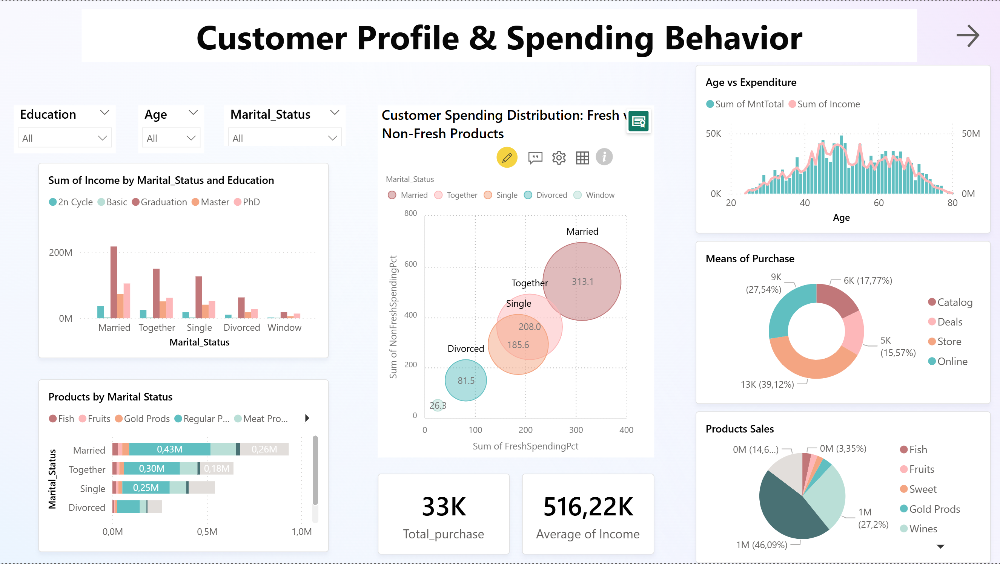
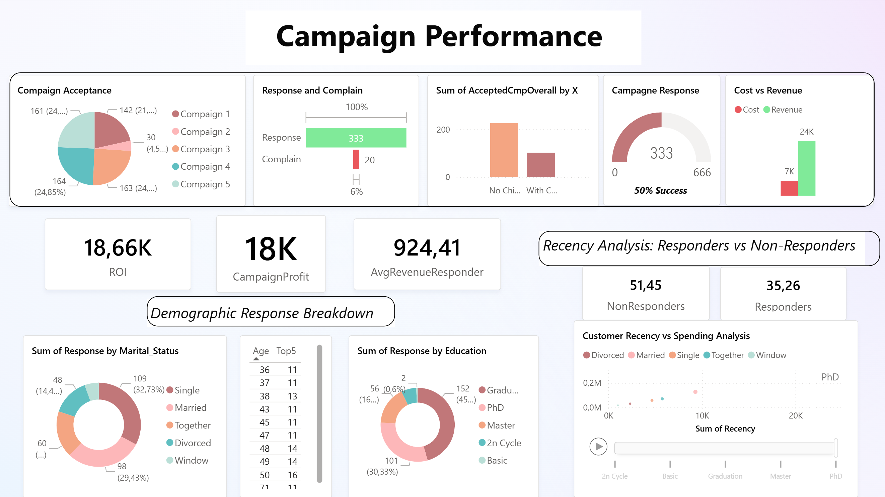

# Marketing Campaign Insights Analysis 

## 📊 Dashboard 1: Customer Profile & Spending Behavior

This dashboard provides insights into **customer demographics, income, and purchasing habits**, helping you understand who your customers are and how they spend.

### 🔍 Key Visuals:
- **Demographic Filters**: Slicers for Education, Age, and Marital Status allow dynamic filtering of all visuals.
- **Income by Marital Status and Education**: Bar chart showing income distribution segmented by education level.
- **Spending Distribution**: Bubble chart comparing spending on fresh vs. non-fresh products across marital statuses.
- **Age vs. Expenditure**: Dual-axis chart showing income and expenditure patterns by age.
- **Purchase Channels**: Donut chart showing how customers make purchases (Catalog, Store, Online, etc.).
- **Product Sales by Marital Status**: Horizontal bar chart breaking down product types purchased by marital status.
- **KPIs**:
  - `33K` Total Purchases
  - `516.22K` Average Income

### 📈 Purpose:
This dashboard is ideal for **profiling customers** and identifying how different demographic segments behave in terms of income and spending.

---

## 📊 Dashboard 2: Campaign Performance

This dashboard evaluates **marketing campaign effectiveness** and **customer response behavior**, helping optimize campaign strategies.

### 🔍 Key Visuals:
- **Campaign Acceptance**: Pie chart of customer responses across multiple campaigns.
- **Response vs. Complaints**: Bar chart showing success and dissatisfaction rates.
- **Accepted Campaigns by Family Status**: Bar chart comparing campaign acceptance across family contexts.
- **Campaign Success Gauge**: Gauge chart showing overall campaign success rate (e.g., 50%).
- **Cost vs Revenue**: Bar chart comparing marketing costs with generated revenue.
- **Demographic Response Breakdown**:
  - By Marital Status and Education (donut charts)
  - By Age (top 5 responders)
- **Recency Analysis**: Scatter plot showing how recently different education levels have responded to campaigns.
- **KPIs**:
  - `18.66K` ROI
  - `18K` Campaign Profit
  - `924.41` Average Revenue per Responder
  - `51.45` Non-Responders vs `35.26` Responders (engagement breakdown)

### 📈 Purpose:
Use this dashboard to measure **which campaigns perform best**, how different customer segments respond, and where to focus future efforts.

